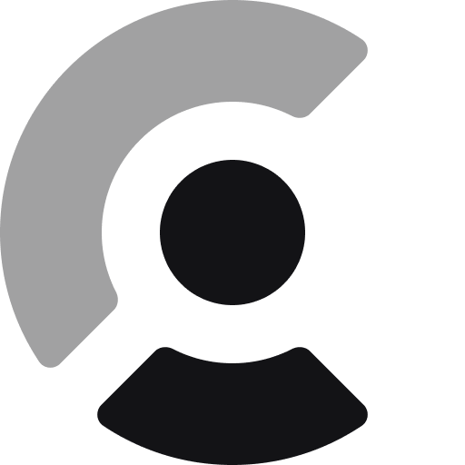

  <a href="https://clerk.com?utm_source=github&utm_medium=clerk_docs" target="_blank" rel="noopener noreferrer">
    <picture>
      <source media="(prefers-color-scheme: dark)" srcset="./public/mark-dark.png">
      
    </picture>
  </a>
   

  <h1>
    Clerk Demos
  </h1>
  
  
  
   

## About 
A catalog of demos that highlight clerk functionality

## Learn more

To learn more about Clerk and Next.js, check out the following resources:

- [Quickstart: Get started with Next.js and Clerk](https://clerk.com/docs/quickstarts/nextjs?utm_source=DevRel&utm_medium=docs&utm_campaign=templates&utm_content=clerk-nextjs-app-quickstart)

- [Clerk Documentation](https://clerk.com/docs?utm_source=DevRel&utm_medium=docs&utm_campaign=templates&utm_content=clerk-nextjs-app-quickstart)
- [Next.js Documentation](https://nextjs.org/docs)

## Found an issue or want to leave feedback

For support, [contact us](https://clerk.com/contact/support) or email [support@clerk.com](mailto:support@clerk.com).

## Connect with us

You can discuss ideas, ask questions, and meet others from the community in our [Discord](https://clerk.com/discord).

You can also follow [@clerk on X](https://x.com/clerk) for updates.
